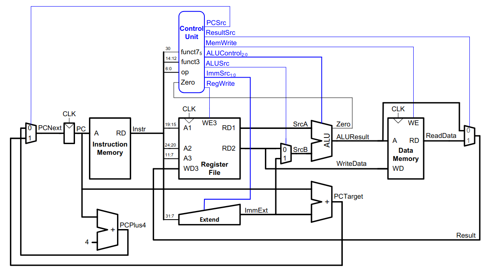
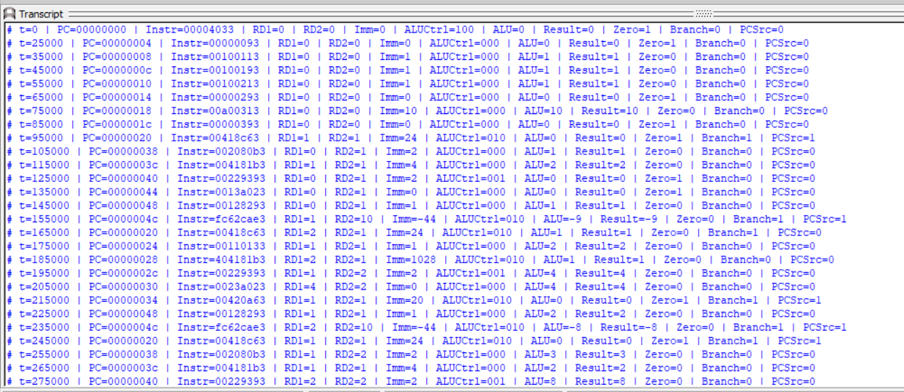
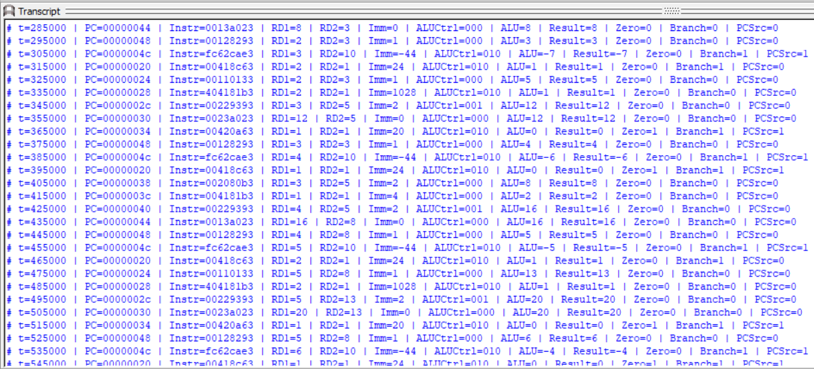
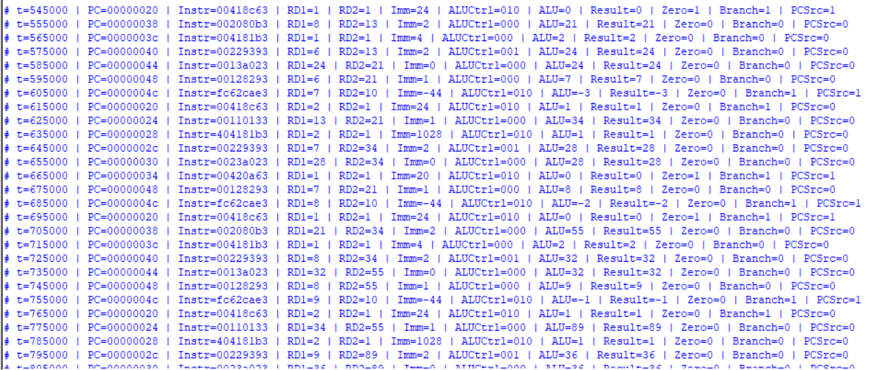
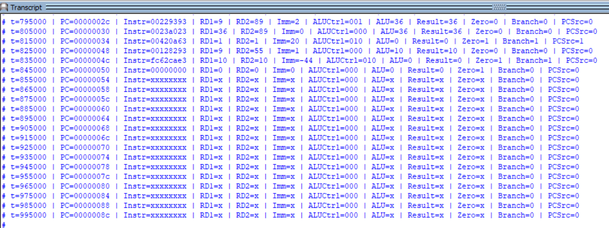
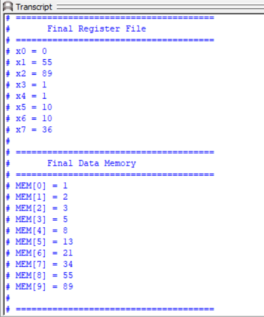
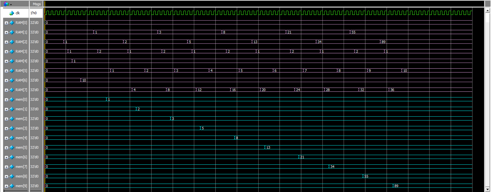

# RISC-V Single-Cycle Processor

## Overview
This project implements a 32-bit Single-Cycle RISC-V Processor using Verilog HDL.

## Processor Datapath

  

The following figure illustrates the complete single-cycle RISC-V datapath implemented in this project.

## Features
- RV32I instruction subset
- Single-cycle architecture
- 32-bit datapath
- Register File
- ALU
- Instruction Memory
- Data Memory
- Control Unit
- Branch Unit

## Simulation Results

### Execution Transcript

### Waveform

## Documentation

The complete project report is available here:

📄 [RISC-V Processor Report](RISCV_Processor_Report.pdf)
